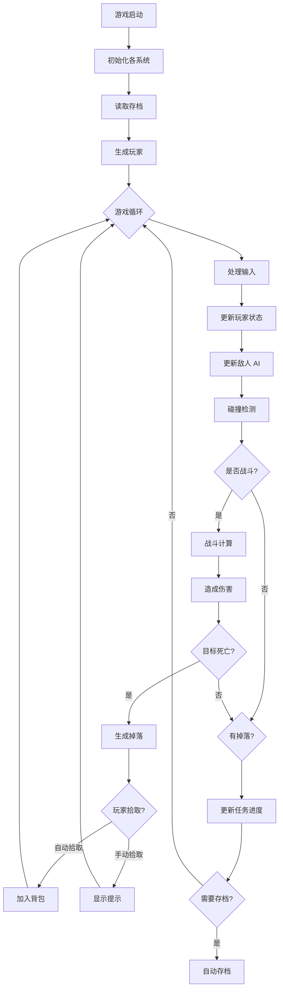
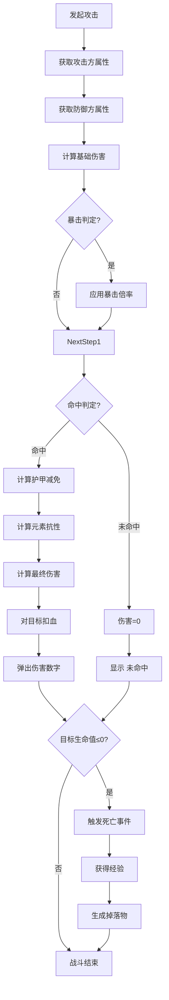
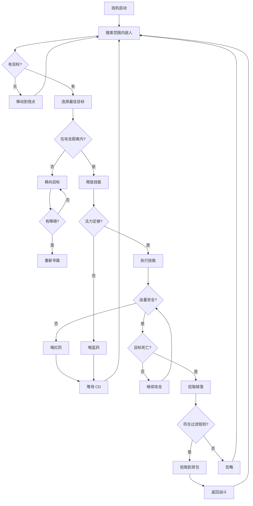
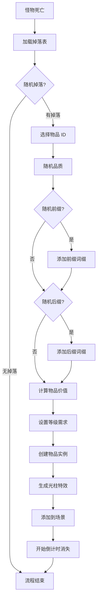
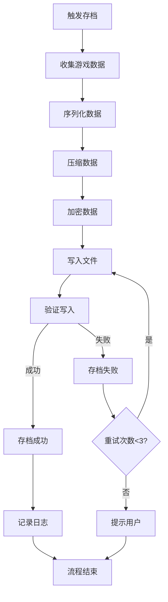

# 02-暗黑挂机游戏 - 技术实现方案详解

## 📋 文档概述

本文档基于 Godot 4.x 引擎，详细描述暗黑挂机刷刷刷小游戏的技术实现方案。包含系统架构、节点组织、核心流程和数据管理等内容。

**开发方案：标准版（7-8 周）**
- 核心战斗系统
- 角色养成系统
- 装备系统
- 挂机系统 ⭐
- 基础存档和 UI

---

## 一、项目整体架构

### 1.1 技术栈选型

**引擎版本：**
- Godot 4.5
- 渲染器：Mobile（支持 2D/3D）
- 脚本语言：GDScript

**游戏视角：**
- **2D 俯视角**（使用 2D 场景 + Sprite/Texture）
- 摄像机：正交投影（Orthographic）

**架构模式：**
- 单例模式（Singleton）：管理全局状态
- 组件模式（Component）：功能模块化
- 事件驱动（Event-driven）：解耦系统间通信
- 对象池（Object Pool）：优化性能

---

### 1.2 目录结构规范

```
res://
├── autoload/                 # 全局单例脚本
│   ├── GameManager.gd       # 游戏总管理器
│   ├── EntityManager.gd     # 实体管理器
│   ├── CombatSystem.gd      # 战斗计算系统
│   ├── ItemDatabase.gd      # 物品数据库
│   ├── SaveSystem.gd        # 存档系统
│   └── EventBus.gd          # 全局事件总线
│
├── scenes/                   # 场景文件
│   ├── main/                # 主场景
│   │   └── Main.tscn
│   ├── character/           # 角色相关
│   │   ├── Player.tscn      # 玩家场景 (CharacterBody2D)
│   │   └── Enemy.tscn       # 敌人场景 (CharacterBody2D)
│   ├── ui/                  # UI 界面
│   │   ├── HUD.tscn
│   │   ├── Inventory.tscn
│   │   └── CharacterPanel.tscn
│   └── world/               # 世界场景
│       ├── Dungeon.tscn     # 2D 地牢
│       └── Town.tscn        # 2D 城镇
│
├── scripts/                  # 脚本文件
│   ├── character/           # 角色脚本
│   │   ├── Player.gd
│   │   ├── PlayerStats.gd
│   │   └── PlayerController.gd
│   ├── enemy/               # 敌人脚本
│   │   ├── Enemy.gd
│   │   └── EnemyAI.gd
│   ├── combat/              # 战斗相关
│   │   ├── DamageCalculator.gd
│   │   └── Skill.gd
│   ├── items/               # 物品相关
│   │   ├── Item.gd
│   │   ├── Equipment.gd
│   │   └── LootGenerator.gd
│   └── ai/                  # AI 相关
│       └── HangupAI.gd      # 挂机 AI 逻辑
│
├── resources/                # 资源文件
│   ├── data/                # 数据配置
│   │   ├── items.json       # 物品配置表
│   │   ├── enemies.json     # 怪物配置表
│   │   └── skills.json      # 技能配置表
│   ├── sprites/             # 2D 精灵图
│   │   ├── characters/      # 角色精灵
│   │   ├── enemies/         # 敌人精灵
│   │   ├── items/           # 物品图标
│   │   └── tiles/           # 地图瓦片
│   ├── animations/          # 动画资源
│   └── audio/               # 音频资源
│
├── shaders/                  # 着色器
│   ├── drop_light.shader    # 掉落光柱 shader(2D)
│   └── fog_of_war.shader    # 战争迷雾 shader
│
└── doc/                     # 文档目录
    └── ...
```

---

## 二、Godot 节点组织架构

### 2.1 主场景节点树

```
Main (Node2D)
│
├── Camera2D (Camera2D)                      # 主摄像机（2D）
│   └── [跟随玩家移动]
│
├── GameManager (Node)                       # 游戏管理器（单例）
│   ├── EventBus (Node)                          # 事件总线
│   └── SaveSystem (Node)                        # 存档系统
│
├── PlayerManager (Node)                         # 玩家管理器（单例）
│   └── Player (CharacterBody2D)                 # 玩家实例（2D 刚体）
│       ├── CollisionShape2D                     # 2D 碰撞体（圆形/胶囊）
│       ├── Sprite                               # 2D 精灵渲染
│       ├── AnimatedSprite2D                     # 2D 动画精灵
│       ├── NavigationAgent2D                    # 2D 寻路代理
│       ├── RayCast2D (攻击判定)                 # 2D 攻击射线
│       └── Area2D (拾取范围)                    # 2D 拾取检测区域
│
├── EnemyManager (Node)                          # 敌人生成器
│   └── EnemySpawner (Node2D)                    # 2D 生成点管理器
│       ├── SpawnPoint1 (Marker2D)
│       └── SpawnPoint2 (Marker2D)
│
├── ItemManager (Node)                           # 物品管理器
│   └── DroppedItems (Node2D)                    # 2D 掉落物品容器
│       └── [动态生成的物品实例]
│
├── UIManager (CanvasLayer)                      # UI 管理层
│   ├── HUD (Control)                            # 抬头显示
│   │   ├── HealthBar (ProgressBar)
│   │   ├── ManaBar (ProgressBar)
│   │   ├── ExpBar (ProgressBar)
│   │   ├── LevelLabel (Label)
│   │   └── SkillBar (HBoxContainer)
│   │       └── SkillButton1/2/3/4 (TextureButton)
│   │
│   ├── InventoryWindow (Window)                 # 背包窗口
│   │   └── GridContainer                        # 物品格子
│   │
│   ├── CharacterWindow (Window)                 # 角色窗口
│   │   ├── EquipmentSlots                       # 装备槽
│   │   └── StatsPanel                           # 属性面板
│   │
│   └── HangupConfig (Window)                    # 挂机配置窗口
│       ├── SkillPriority (VBoxContainer)
│       ├── HealthThreshold (HSlider)
│       └── LootFilter (CheckButton)
│
└── Minimap (SubViewport)                        # 小地图（子视口）
    └── Camera2D (Camera2D)                      # 小地图专用 2D 摄像机
```

---

### 2.2 玩家场景详细结构

```
Player (CharacterBody2D)
│
├── Components (Node)                            # 组件容器
│   ├── Stats (Node)                             # 属性组件
│   │   ├── BaseStats (Resource)                 # 基础属性资源
│   │   └── DerivedStats (Resource)              # 衍生属性资源
│   │
│   ├── Skills (Node)                            # 技能组件
│   │   ├── SkillSlot1 (Skill Resource)
│   │   ├── SkillSlot2 (Skill Resource)
│   │   ├── SkillSlot3 (Skill Resource)
│   │   └── SkillSlot4 (Skill Resource)
│   │
│   └── Equipment (Node)                         # 装备组件
│       ├── Head (Equipment Resource)
│       ├── Body (Equipment Resource)
│       ├── Weapon (Equipment Resource)
│       ├── Accessory1 (Equipment Resource)
│       └── Accessory2 (Equipment Resource)
│
├── Controller (Node)                            # 控制器
│   ├── MovementController.gd                    # 2D 移动控制
│   ├── AttackController.gd                      # 攻击控制
│   └── InputHandler.gd                          # 输入处理
│
└── Visuals (Node2D)                             # 2D 表现层
    ├── Sprite (Sprite2D)                        # 2D 精灵
    ├── AnimatedSprite (AnimatedSprite2D)        # 2D 动画精灵
    ├── Effects (GPUParticles2D)                 # 2D 粒子特效
    └── Light (PointLight2D)                     # 2D 点光源（可选）
```

---

### 2.3 敌人场景结构

```
Enemy (CharacterBody2D)
├── CollisionShape2D                             # 2D 碰撞体
├── Sprite (Sprite2D)                            # 2D 精灵
├── AnimatedSprite2D                             # 2D 动画精灵
├── NavigationAgent2D                            # 2D 寻路代理
├── Area2D (DetectionRange)                      # 2D 侦测范围
│   └── CollisionShape2D
│
├── Stats (Node)
│   ├── MaxHealth (float)
│   ├── CurrentHealth (float)
│   ├── Damage (float)
│   └── ExperienceValue (int)
│
├── AI (Node)
│   ├── StateMachine (Node)                      # 状态机
│   │   ├── IdleState (State)
│   │   ├── ChaseState (State)
│   │   ├── AttackState (State)
│   │   └── ReturnState (State)
│   └── Blackboard (Node)                        # 黑板数据
│
└── LootTable (Resource)                         # 掉落表资源
    └── 掉落配置数据
```

---

### 2.4 自动加载单例（Autoload）

在 **项目设置 → Autoload** 中注册以下单例：

| 路径 | 名称 | 作用 |
|------|------|------|
| `autoload/GameManager.gd` | `GameManager` | 游戏状态管理（菜单/游戏中/暂停） |
| `autoload/EntityManager.gd` | `EntityManager` | 所有实体的注册与查找 |
| `autoload/CombatSystem.gd` | `CombatSystem` | 战斗计算核心逻辑 |
| `autoload/ItemDatabase.gd` | `ItemDatabase` | 物品数据查询与生成 |
| `autoload/SkillDatabase.gd` | `SkillDatabase` | 技能数据查询 |
| `autoload/SaveSystem.gd` | `SaveSystem` | 存档读写 |
| `autoload/EventBus.gd` | `EventBus` | 全局事件信号总线 |
| `autoload/ObjectPool.gd` | `ObjectPool` | 对象池管理（优化性能） |

---

## 三、核心系统流程图

### 3.1 游戏主循环流程



---

### 3.2 战斗计算流程



---

### 3.3 挂机 AI 决策流程



---

### 3.4 装备掉落生成流程



---

### 3.5 存档系统流程



---

## 四、数值公式参考表

### 4.1 角色属性公式

#### 基础属性成长

```
升级所需经验 = 100 × (当前等级 ^ 1.5)
向下取整，例如：
- 1 级升 2 级：100 × 1^1.5 = 100 EXP
- 5 级升 6 级：100 × 5^1.5 ≈ 1118 EXP
- 10 级升 11 级：100 × 10^1.5 ≈ 3162 EXP
```

#### 生命值计算

```
最大生命值 = 基础生命 + (体力 × 生命系数) + 装备加成
推荐参数:
- 基础生命：50
- 生命系数：10
- 每级成长：+2 基础生命

示例：
1 级角色，体力 10，无装备
最大生命 = 50 + (10 × 10) + 0 = 150

10 级角色，体力 50，装备 +100 生命
最大生命 = (50 + 10×2) + (50 × 10) + 100 = 70 + 500 + 100 = 670
```

#### 法力值计算

```
最大法力值 = 基础法力 + (智力 × 法力系数) + 装备加成
推荐参数:
- 基础法力：20
- 法力系数：15
- 每级成长：+1 基础法力
```

---

### 4.2 战斗计算公式

#### 物理伤害计算

```
基础伤害 = 武器伤害 + (力量 × 力量系数)
力量系数推荐：0.5 ~ 1.0（根据职业区分）

最终物理伤害 = 基础伤害 × 技能倍率 × (1 + 增伤百分比)
              × 护甲穿透系数 × 位置倍率

护甲减伤公式（推荐两种方案）:

【方案 A - 简单线性】
实际伤害 = 原始伤害 × (1 - 护甲 / (护甲 + K))
K 值推荐：1000（随等级递增）

【方案 B - 百分比护甲】
护甲减伤% = 护甲 / (护甲 + 100 ×  attackerLevel)
最低不低于 5%，最高不超过 75%

示例（方案 B）:
80 级玩家，护甲 500，受到 1000 点物理伤害
护甲减伤 = 500 / (500 + 100×80) = 500 / 8500 ≈ 5.88%
实际伤害 = 1000 × (1 - 0.0588) ≈ 941
```

#### 元素伤害计算

```
元素伤害 = 基础元素伤害 × (1 + 元素增强%)
实际元素伤害 = 元素伤害 × (1 - 元素抗性%)

元素抗性上限：75%（可通过装备突破）
元素穿透：无视部分抗性
实际抗性 = 目标抗性 - 自身穿透（最低 0%）
```

#### 暴击计算

```
暴击率 = 基础暴击率 + (敏捷 × 敏捷系数) + 装备暴击率
敏捷系数推荐：0.1 ~ 0.2

暴击伤害 = 基础伤害 × 暴击倍率
基础暴击倍率：150% (1.5x)
暴击伤害增加：通过装备/技能提升

示例：
玩家暴击率 25%，暴击爆伤 200%
攻击造成 1000 点伤害
- 75% 概率造成 1000 伤害
- 25% 概率造成 1000 × 2.0 = 2000 伤害
期望伤害 = 1000 × 0.75 + 2000 × 0.25 = 1250
```

#### 命中与闪避

```
命中率 = 基础命中率 + (攻击方命中 - 防御方闪避) / 系数
基础命中率：95%
系数推荐：100

最低命中率：50%
最高命中率：100%

闪避成功：完全躲避攻击，伤害为 0
```

---

### 4.3 攻速与施法速度

#### 攻击速度

```
武器基础攻速：每秒攻击次数
例如：长剑 1.2 次/秒，匕首 1.8 次/秒

实际攻速 = 基础攻速 × (1 + 攻速增加%)
攻速上限：通常为基础攻速的 200%

攻击间隔 = 1 / 实际攻速
```

#### 施法速度

```
技能基础施法时间：秒
例如：火球术 1.0 秒，冰箭术 0.8 秒

实际施法时间 = 基础施法时间 / (1 + 施法速度%)
施法速度上限：通常 100%（即减少 50% 施法时间）

冷却缩减 = 基础 CD × (1 - CDR%)
CDR 上限：推荐 50% ~ 75%
```

---

### 4.4 装备属性生成

#### 物品等级与属性区间

```
物品等级 (iLevel) 决定属性上下限：

【武器 DPS】
最小 DPS = iLevel × 系数 A
最大 DPS = iLevel × 系数 B
系数 A 推荐：1.5 ~ 2.0
系数 B 推荐：2.5 ~ 3.5

【防具护甲】
护甲值 = iLevel × 系数 × 部位系数
部位系数：
- 衣服：1.0
- 头盔：0.7
- 鞋子：0.5
- 手套：0.5

【饰品属性】
主属性（力/敏/智）= iLevel × 系数 (3~5)
副属性（暴击/攻速等）= 固定百分比区间
```

#### 词缀生成权重

```
品质权重分布：

【普通（白色）】
- 基础属性：100%
- 额外词缀：0%

【魔法（蓝色）】
- 基础属性：100%
- 前缀：100% 概率 1 条
- 后缀：50% 概率 1 条

【稀有（黄色）】
- 基础属性：100%
- 前缀：100% 概率 1-2 条
- 后缀：100% 概率 1-2 条
- 总词缀数：2-4 条

【传奇（橙色）】
- 基础属性：120%（超越常规上限）
- 前缀：2-3 条
- 后缀：2-3 条
- 特殊效果：1 条（传奇专属）
- 总词缀数：5-7 条
```

#### 词缀数值区间

```
前缀示例（以 iLevel 80 为例）：
"+力量": 20-30
"+攻击力%": 5%-10%
"+暴击率": 2%-5%
"+生命偷取": 1%-3%

后缀示例：
"的生命值": 50-100
"的火焰抗性": 10%-20%
"的格挡率": 2%-5%
```

---

### 4.5 经济与掉落公式

#### 金币掉落

```
怪物金币掉落 = 基础金币 × (1 + 金币增加%)
基础金币 = 怪物等级 × 系数 (5~10)

精英怪系数：×3 ~ ×5
BOSS 系数：×10 ~ ×20
```

#### 经验值获取

```
杀怪经验 = 怪物基础经验 × 等级修正 × 组队修正

怪物基础经验 = 怪物等级 × 系数 (20~30)
等级修正：
- 玩家等级 = 怪物等级：100%
- 玩家等级 < 怪物等级：每低 1 级 +10%，最高 150%
- 玩家等级 > 怪物等级：每高 1 级 -20%，最低 20%

组队修正：
- 单人：100%
- 2 人组队：每人 80%
- 3 人组队：每人 70%
- 4 人组队：每人 60%
```

#### 物品价格

```
基础价格 = iLevel × 系数 (10~20)

品质系数：
- 普通：1.0
- 魔法：2.5
- 稀有：6.0
- 传奇：15.0

词缀加成：每条词缀 +20% 价格

出售价格 = 基础价格 × 品质系数 × 词缀系数 × 0.5
购买价格 = 基础价格 × 品质系数 × 词缀系数
```

---

### 4.6 挂机效率计算

#### 挂机 DPS 估算

```
挂机 DPS = (技能伤害 × 技能频率) + 普攻 DPS
技能频率 = 60 / 技能 CD(秒)

考虑法力限制：
持续 DPS = 总伤害 / (输出时间 + 回蓝时间)

回蓝时间 = (总耗蓝 - 自然回蓝) / 药水回复量 × 喝药 CD
```

#### 离线收益

```
基准收益 = 挂机 DPS × 怪物平均血量 × 刷新率
每小时收益 = 基准收益 × 3600

实际离线收益 = 每小时收益 × 离线时长 × 衰减系数

衰减系数：
- 0-4 小时：100%
- 4-8 小时：每小时 -10%
- 8-12 小时：每小时 -20%
- 超过 12 小时：不再累积

最大收益上限：建议不超过在线 1 小时的收益
```

---

### 4.7 难度曲线设计

#### 怪物属性成长

```
怪物等级 = 区域基础等级 ± 浮动值

怪物血量 = 基础血量 × (1.1 ^ 怪物等级)
怪物伤害 = 基础伤害 × (1.08 ^ 怪物等级)
怪物经验 = 基础经验 × (1.15 ^ 怪物等级)

区域难度系数：
- 普通难度：1.0x
- 噩梦难度：1.5x（怪物属性 +50%）
- 地狱难度：2.0x（怪物属性 +100%）
```

#### 玩家战力评估

```
综合战力 =  DPS 评分 + 生存评分 + 功能性评分

DPS 评分 = (秒伤 × 10) + 暴击评分 + 攻速评分
生存评分 = (有效生命值 / 100) + 抗性评分 + 回复评分
功能性评分 = 移速评分 + CDR 评分 + 特殊效果评分

有效生命值 EHP = 实际生命值 / (1 - 减伤%)
```

---

## 五、关键系统实现细节

### 5.1 事件总线设计

```gdscript
# EventBus.gd (单例)
extends Node

# 战斗相关信号
signal entity_damaged(attacker, target, damage, damage_type)
signal entity_died(entity, killer)
signal experience_gained(amount, total_exp)
signal level_up(new_level)

# 物品相关信号
signal item_picked_up(item, quantity)
signal item_dropped(item, position)
signal equipment_changed(slot, old_item, new_item)

# UI 相关信号
signal health_changed(current, max)
signal mana_changed(current, max)
signal inventory_updated()
signal quest_updated(quest_id, progress)

# 挂机相关信号
signal hangup_started()
signal hangup_stopped()
signal target_changed(old_target, new_target)
```

**使用示例：**
```gdscript
# 发送事件
EventBus.emit_signal("entity_damaged", attacker, target, 150, "physical")

# 监听事件
func _ready():
    EventBus.entity_damaged.connect(_on_entity_damaged)

func _on_entity_damaged(attacker, target, damage, damage_type):
    # 更新 UI 伤害统计
    update_damage_meter(damage)
```

---

### 5.2 对象池实现

```gdscript
# ObjectPool.gd (单例)
extends Node

var pools = {}  # 对象池字典
var pool_size = 20  # 每个池默认大小

func _ready():
    # 预初始化对象池
    create_pool("damage_number", preload("res://scenes/ui/DamageNumber.tscn"))
    create_pool("enemy", preload("res://scenes/enemy/Enemy.tscn"))
    create_pool("item_drop", preload("res://scenes/items/DroppedItem.tscn"))

func create_pool(pool_name, scene):
    pools[pool_name] = []
    for i in range(pool_size):
        var instance = scene.instantiate()
        instance.set_process(false)  # 初始不激活
        add_child(instance)
        pools[pool_name].append(instance)

func get_from_pool(pool_name):
    if pools.has(pool_name):
        for obj in pools[pool_name]:
            if not obj.is_inside_tree() or not obj.visible:
                obj.set_process(true)
                obj.visible = true
                return obj
        
        # 池已满，创建新实例
        var scene = get_scene_for_pool(pool_name)
        var instance = scene.instantiate()
        add_child(instance)
        pools[pool_name].append(instance)
        return instance
    return null

func return_to_pool(pool_name, obj):
    obj.visible = false
    obj.set_process(false)
    # 可选：obj.queue_free() 如果不需要复用
```

---

### 5.3 寻路系统

```gdot
使用 Godot 4 的 NavigationServer2D：

1. 为地面添加 NavigationRegion2D 节点
2. 烘焙 2D 导航网格（Bake NavMesh）
3. 玩家和敌人添加 NavigationAgent2D 组件

关键代码逻辑：
- 设置目标点：navigation_agent.target_position = target_pos (Vector2)
- 获取下一个路径点：navigation_agent.get_next_path_position()
- 判断是否到达：navigation_agent.is_navigation_finished()
```

---

### 5.4 数据持久化

```gdscript
# 存档数据结构
{
    "version": "1.0",
    "save_time": "2026-04-02 12:00:00",
    "playtime_seconds": 3600,
    
    "player": {
        "level": 10,
        "experience": 5000,
        "stats_points": 5,
        "skill_points": 3,
        "base_stats": {"str": 20, "agi": 15, "int": 10, "vit": 25},
        "position": {"x": 100.5, "y": 0.0, "z": 200.3},
        "current_map": "dungeon_01"
    },
    
    "equipment": {
        "head": {...},
        "body": {...},
        "weapon": {...},
        ...
    },
    
    "inventory": {
        "items": [...],
        "gold": 5000
    },
    
    "quests": {
        "completed": [1, 2, 3],
        "active": {"quest_04": {"progress": 15, "target": 20}}
    },
    
    "world_state": {
        "unlocked_waypoints": ["town", "dungeon_01"],
        "killed_bosses": ["boss_01"]
    }
}
```

---

## 六、性能优化建议

### 6.1 渲染优化

```
1. 合批处理（Batching）
   - Godot 自动合并相同材质的 2D 绘制调用
   - 使用 TextureAtlas 减少材质切换

2. 视口剔除（Visibility Culling）
   - 只渲染摄像机范围内的物体
   - 使用 VisibleOnScreenNotifier2D

3. 粒子系统优化
   - 限制同时存在的 2D 粒子数量
   - 使用 GPU 粒子而非 CPU 粒子

4. 精灵优化
   - 使用合适的纹理压缩格式
   - 复用精灵帧（Animation 共享 SpriteFrames）
```

### 6.2 逻辑优化

```
1. 距离检查优化
   - 使用 distance_squared 而非 distance（避免开方运算）
   - 分层更新：近距离实体高频更新，远距离低频更新

2. 碰撞检测优化
   - 使用碰撞层（Collision Layer）过滤不必要的检测
   - 先做包围盒检测，再做精细检测

3. 数据结构优化
   - 使用空间分区（四叉树/八叉树）管理大量实体
   - 使用对象池避免频繁创建销毁
```

### 6.3 内存优化

```
1. 资源加载策略
   - 按需加载，及时释放不用的资源
   - 使用 ResourceLoader.load_threaded_request() 异步加载

2. 纹理压缩
   - 使用 VRAM 压缩格式（ETC2、ASTC）
   - 根据平台选择合适的纹理格式

3. 音频优化
   - 长音频使用流式播放
   - 短音效预加载到内存
```

---

## 七、调试与测试工具

### 7.1 开发者控制台

```gdscript
# 控制台命令示例：
/god_mode          # 无敌模式
/add_gold 1000     # 添加金币
/add_exp 5000      # 添加经验
/set_level 50      # 设置等级
/spawn_enemy boss  # 生成 BOSS
/clear_bag         # 清空背包
/fps               # 显示 FPS
```

### 7.2 数值测试工具

```
1. DPS 模拟器
   - 输入玩家属性和技能
   - 模拟输出循环
   - 计算理论 DPS

2. 战斗回放
   - 录制战斗过程
   - 逐帧分析伤害计算
   - 查找数值异常

3. 挂机效率分析
   - 统计每小时收益
   - 分析死亡次数
   - 优化挂机策略
```

---

## 八、扩展性设计

### 8.1 多职业系统

```
使用继承和多态：
- 基类：Player
- 子类：Warrior、Mage、Archer、Necromancer

每个职业有：
- 独特的主属性（力量/智力/敏捷）
- 专属技能树
- 不同的攻击动画和特效
```

### 8.2 多人联机（可选）

```
网络架构：
- 客户端 - 服务器模式
- 使用 ENet 或 WebSocket
- 状态同步或帧同步

同步内容：
- 玩家位置
- 技能释放
- 伤害计算结果
- 掉落分配
```

### 8.3 MOD 支持

```
1. 配置文件外部化
   - JSON 配置表放在可访问的目录
   - 支持玩家自定义配置

2. 资源热替换
   - 允许替换贴图、模型
   - 提供 MOD 接口文档

3. 脚本 hooks
   - 在关键逻辑预留钩子函数
   - 允许注入自定义逻辑
```

---

*文档版本：v1.0*  
*创建日期：2026-04-02*  
*适用引擎：Godot 4.x*  
*开发方案：标准版（7-8 周）*
