# 04-暗黑挂机游戏 - 核心系统流程图详解

## 📋 文档概述

本文档使用 Mermaid 流程图和文字描述，详细说明游戏的各个核心系统的工作流程。包括战斗系统、挂机 AI、物品掉落、任务系统等关键模块。

---

## 一、游戏主循环流程

### 1.1 完整的游戏循环

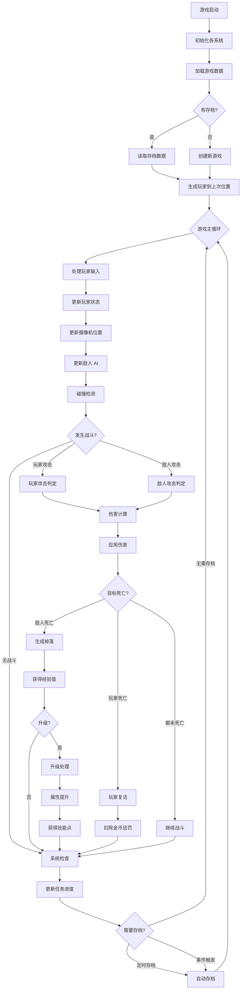

---

## 二、战斗系统详细流程

### 2.1 玩家攻击流程

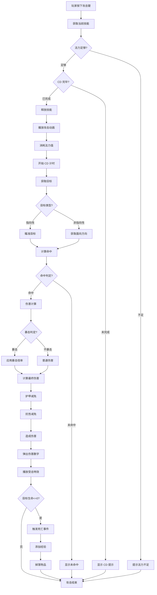

### 2.2 伤害计算子流程

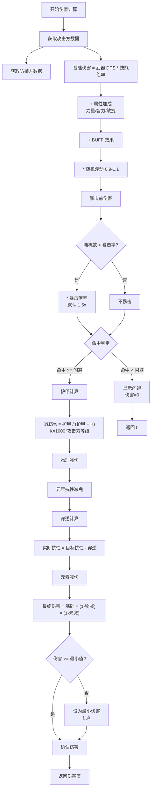

### 2.3 敌人 AI 决策流程

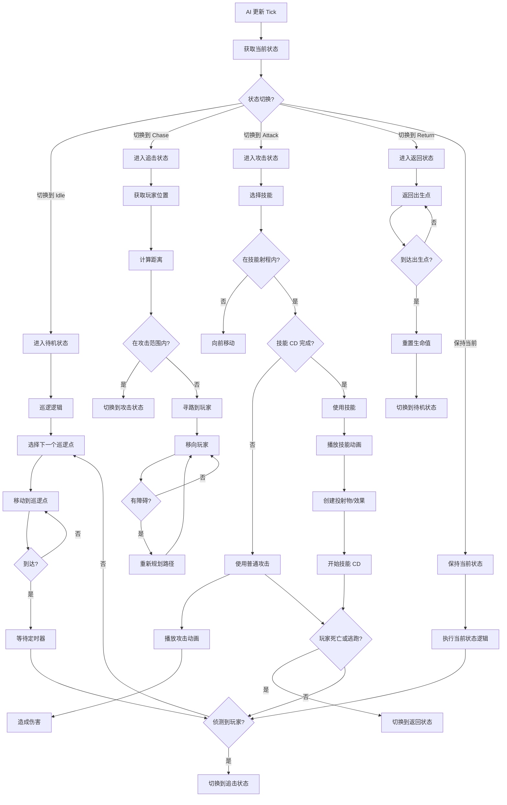

---

## 三、挂机 AI 系统流程

### 3.1 挂机主循环

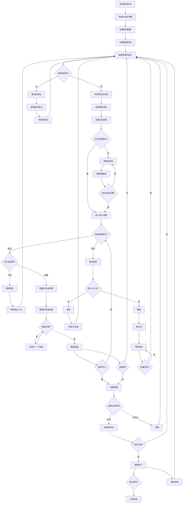

### 3.2 技能释放优先级算法

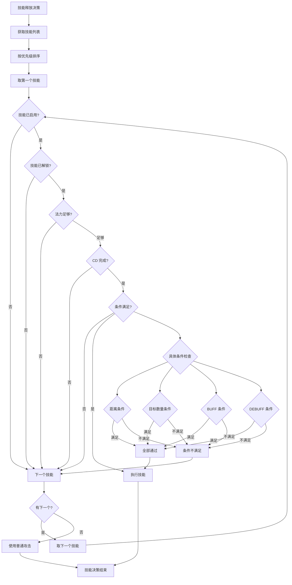

### 3.3 拾取过滤规则

```mermaid
graph TB
    ItemDrop[物品掉落] --> ItemSpawn[生成物品实例]
    ItemSpawn --> StartDespawn[开始倒计时消失]
    StartDespawn --> PlayerNearby{玩家在附近?}
    
    PlayerNearby -->|否 | WaitPickup[等待拾取]
    PlayerNearby -->|是 | AutoPickupCheck{启用自动拾取?}
    
    AutoPickupCheck -->|否 | ShowPrompt[显示拾取提示]
    AutoPickupCheck -->|是 | FilterCheck[过滤规则检查]
    
    FilterCheck --> QualityCheck{品质检查}
    QualityCheck --> CommonCheck{捡普通?}
    QualityCheck --> MagicCheck{捡魔法?}
    QualityCheck --> RareCheck{捡稀有?}
    QualityCheck --> LegendCheck{捡传奇?}
    
    CommonCheck -->|是 | Pass[通过检查]
    CommonCheck -->|否 | NextQuality1[检查下一级]
    
    MagicCheck -->|是 | Pass
    MagicCheck -->|否 | NextQuality2[检查下一级]
    
    RareCheck -->|是 | Pass
    RareCheck -->|否 | NextQuality3[检查下一级]
    
    LegendCheck -->|是 | Pass
    LegendCheck -->|否 | SkipItem[跳过物品]
    
    NextQuality1 --> MagicCheck
    NextQuality2 --> RareCheck
    NextQuality3 --> LegendCheck
    
    Pass --> TypeCheck{类型检查}
    TypeCheck --> EquipmentCheck{装备?}
    TypeCheck --> PotionCheck{药水?}
    TypeCheck --> MaterialCheck{材料?}
    
    EquipmentCheck -->|启用 | PassType[通过类型检查]
    PotionCheck -->|启用 | PassType
    MaterialCheck -->|启用 | PassType
    
    EquipmentCheck -->|禁用 | NextType1[检查下一类型]
    PotionCheck -->|禁用 | NextType2[检查下一类型]
    MaterialCheck -->|禁用 | SkipItem
    
    NextType1 --> PotionCheck
    NextType2 --> MaterialCheck
    
    PassType --> ValueCheck{价值检查}
    ValueCheck --> MinValue{大于最小价值?}
    MinValue -->|是 | FinalPass[最终通过]
    MinValue -->|否 | SkipItem
    
    FinalPass --> MoveToItem[移动到物品]
    MoveToItem --> PickupRange{进入拾取范围?}
    PickupRange -->|否 | MoveToItem
    PickupRange -->|是 | AddToBag[添加到背包]
    
    AddToItem --> BagCheck{背包容量检查}
    BagCheck -->|满 | CannotPickup[无法拾取]
    BagCheck -->|不满 | SuccessPickup[拾取成功]
    
    SuccessPickup --> ShowNotification[显示拾取通知]
    ShowNotification --> FindEnemies[返回战斗]
    
    CannotPickup --> AlertUser[警告用户背包已满]
    AlertUser --> FindEnemies
    
    ShowPrompt --> ManualPickup{手动拾取?}
    ManualPickup -->|是 | AddToBag
    ManualPickup -->|否 | SkipItem
    
    SkipItem --> WaitDespawn[等待消失]
    WaitDespawn --> DespawnTime{时间到?}
    DespawnTime -->|是 | RemoveItem[移除物品]
    DespawnTime -->|否 | PlayerNearby
    
    RemoveItem --> EndFlow[流程结束]
    FindEnemies --> EndFlow
```

---

## 四、物品掉落与生成流程

### 4.1 怪物死亡掉落流程

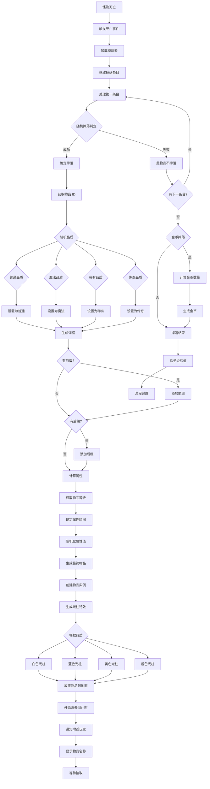

### 4.2 词缀生成算法

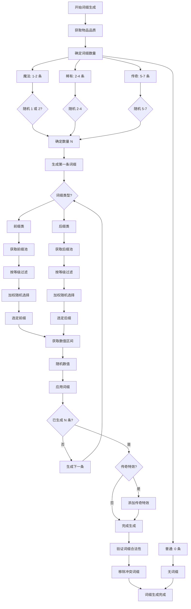

---

## 五、任务系统流程

### 5.1 任务接取与完成流程

```mermaid
graph TB
    QuestStart[任务系统启动] --> LoadQuests[加载任务配置]
    LoadQuests --> CheckAvailable{有可接任务?}
    
    CheckAvailable -->|是 | ShowNPC[NPC 显示感叹号]
    CheckAvailable -->|否 | TrackActive[追踪进行中任务]
    
    ShowNPC --> PlayerInteract{玩家交互?}
    PlayerInteract -->|是 | OpenQuestUI[打开任务界面]
    PlayerInteract -->|否 | ShowNPC
    
    OpenQuestUI --> DisplayQuestInfo[显示任务信息]
    DisplayQuestInfo --> QuestDetail[任务详情]
    QuestDetail --> QuestTitle[任务标题]
    QuestDetail --> QuestDesc[任务描述]
    QuestDetail --> QuestReward[任务奖励]
    QuestDetail --> QuestRequirement[任务要求]
    
    QuestRequirement --> AcceptButton[接受按钮]
    AcceptButton --> PlayerClick{玩家点击接受?}
    
    PlayerClick -->|是 | AcceptQuest[接受任务]
    PlayerClick -->|否 | CloseUI[关闭界面]
    
    AcceptQuest --> AddToActive[添加到活跃任务]
    AddToActive --> UpdateTracker[更新追踪器]
    UpdateTracker --> CloseUI
    
    CloseUI --> TrackActive[追踪进行中任务]
    
    TrackActive --> MonitorProgress[监控任务进度]
    MonitorProgress --> EventType{事件类型}
    
    EventType --> KillEvent[击杀事件]
    EventType --> CollectEvent[收集事件]
    EventType --> ExploreEvent[探索事件]
    EventType --> TalkEvent[对话事件]
    
    KillEvent --> CheckKillTarget{是目标任务?}
    CheckKillTarget -->|是 | IncrementKill[增加击杀计数]
    CheckKillTarget -->|否 | TrackActive
    
    CollectEvent --> CheckCollectItem{是目标物品?}
    CheckCollectItem -->|是 | IncrementCollect[增加收集计数]
    CheckCollectItem -->|否 | TrackActive
    
    ExploreEvent --> CheckExploreArea{是目标区域?}
    ExploreArea -->|是 | MarkExplored[标记已探索]
    ExploreArea -->|否 | TrackActive
    
    IncrementKill --> CheckComplete{任务完成?}
    IncrementCollect --> CheckComplete
    MarkExplored --> CheckComplete
    
    CheckComplete -->|未完成 | TrackActive
    CheckComplete -->|已完成 | UpdateUI[更新 UI 显示]
    
    UpdateUI --> ShowCompleteMark[显示完成标记]
    ShowCompleteMark --> NotifyPlayer[通知玩家]
    
    NotifyPlayer --> ReturnNPC{需要返回 NPC?}
    ReturnNPC -->|是 | ShowReturnArrow[显示返回箭头]
    ReturnNPC -->|否 | AutoComplete[自动完成]
    
    ShowReturnArrow --> PlayerReturn{玩家返回交任务?}
    PlayerReturn -->|是 | TurnInQuest[交付任务]
    PlayerReturn -->|否 | ShowReturnArrow
    
    AutoComplete --> TurnInQuest
    
    TurnInQuest --> GiveReward[发放奖励]
    GiveReward --> ExpReward[经验值]
    GiveReward --> GoldReward[金币]
    GiveReward --> ItemReward[物品奖励]
    
    ExpReward --> AddExp[添加到经验池]
    GoldReward --> AddGold[添加到金币]
    ItemReward --> AddToBag[添加到背包]
    
    AddExp --> MarkComplete[标记任务完成]
    AddGold --> MarkComplete
    AddToBag --> MarkComplete
    
    MarkComplete --> RemoveActive[从活跃移除]
    RemoveActive --> AddHistory[添加到历史记录]
    AddHistory --> CheckChain{有后续任务?}
    
    CheckChain -->|是 | UnlockNext[解锁下一个任务]
    CheckChain -->|否 | QuestEnd[任务结束]
    
    UnlockNext --> QuestStart
    QuestEnd --> QuestStart
```

---

## 六、经济系统流程

### 6.1 金币流通流程

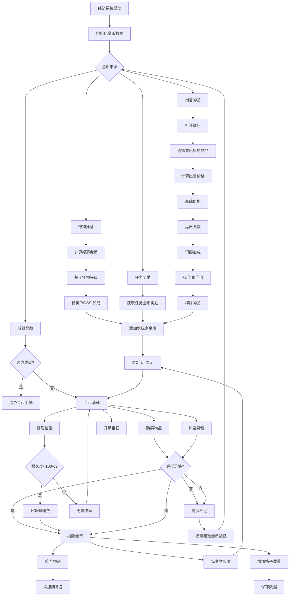

### 6.2 商店交易流程

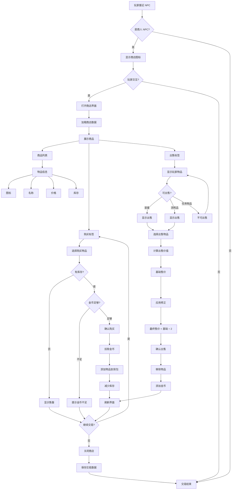

---

## 七、存档系统流程

### 7.1 自动存档流程

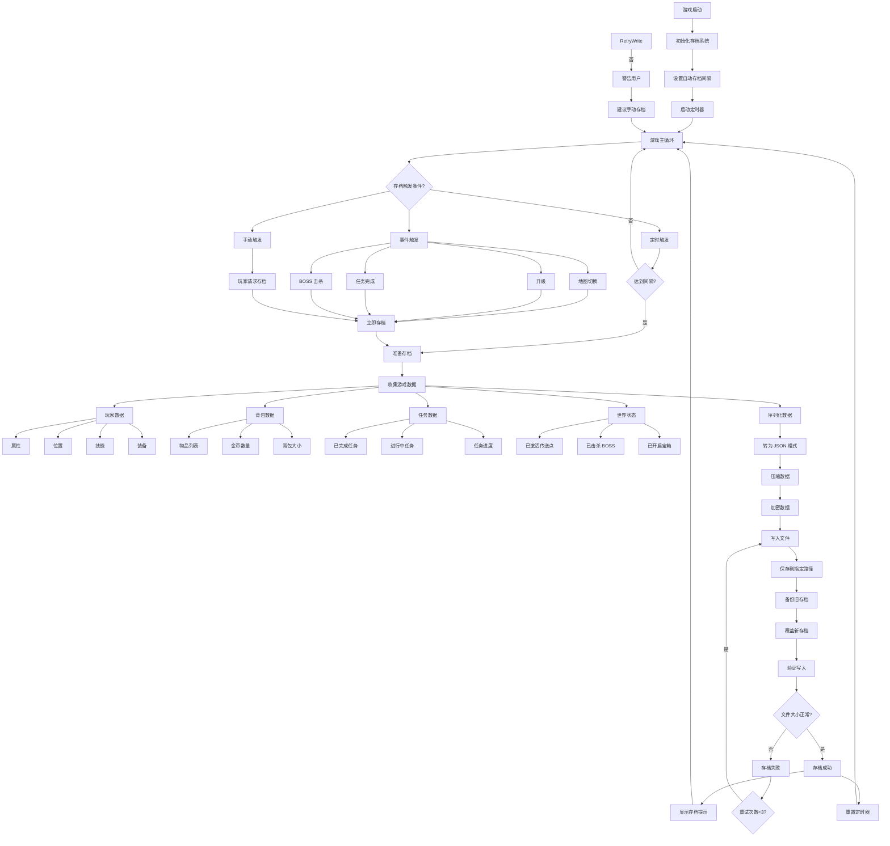

### 7.2 读档流程

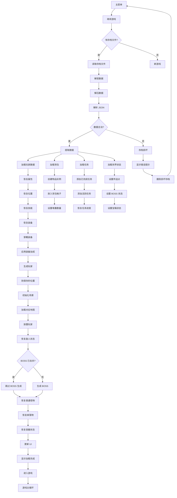

---

## 八、UI 系统流程

### 8.1 UI 打开关闭流程

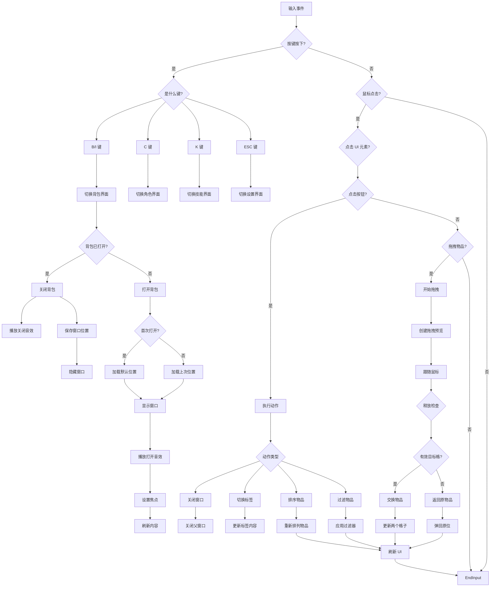

---

*文档版本：v1.0*  
*创建日期：2026-04-02*  
*适用引擎：Godot 4.x*
