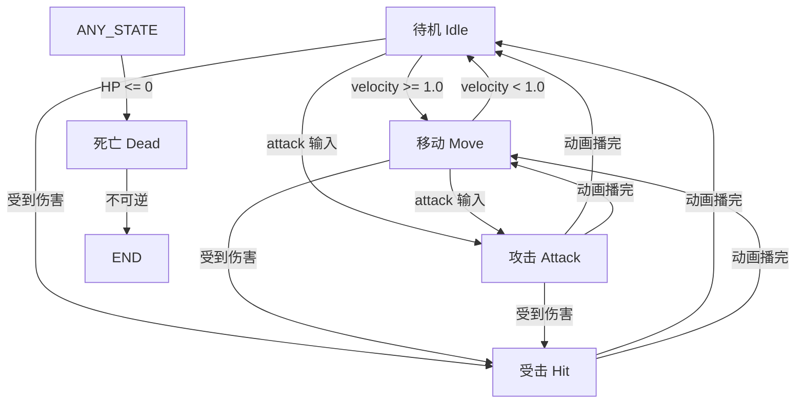

# 06-技术实现细节补充文档

## 📋 文档概述

本文档补充说明前 5 个核心文档中未详细展开的技术实现细节，包括碰撞层配置、动画状态机、Shader 代码示例、对象池管理等内容。

**创建日期：** 2026-04-02  
**适用版本：** v1.0 (2D版)

---

## 一、碰撞层配置详解

### 1.1 碰撞层分配表

```
Layer 1: 玩家 (Player)
Layer 2: 敌人 (Enemy)
Layer 3: 地面 (Ground)
Layer 4: 墙壁/障碍 (Wall/Obstacle)
Layer 5: 掉落物 (Loot)
Layer 6: 投射物 (Projectile)
Layer 7: 触发器 (Trigger)
Layer 8: NPC
Layer 9: 陷阱 (Trap)
Layer 10: 视野遮挡 (LOS Blocker)
```

### 1.2 碰撞掩码配置

```gdscript
# 玩家 (Layer 1)
collision_layer = 1
collision_mask = 2 | 3 | 4 | 5 | 7 | 8 | 9  # 敌人、地面、墙壁、掉落物、触发器、NPC、陷阱

# 敌人 (Layer 2)
collision_layer = 2
collision_mask = 1 | 3 | 4 | 6 | 7 | 9  # 玩家、地面、墙壁、投射物、触发器、陷阱

# 投射物 (Layer 6)
collision_layer = 6
collision_mask = 1 | 2 | 4  # 玩家、敌人、墙壁

# 掉落物 (Layer 5)
collision_layer = 5
collision_mask = 1 | 7  # 玩家、触发器
```

### 1.3 碰撞检测优化

```gdscript
# 使用碰撞层过滤减少不必要的检测
func setup_collision_layers():
    # 玩家不检测其他玩家（单人游戏）
    # 敌人之间不互相碰撞（避免推开）
    # 掉落物之间不碰撞（可重叠）
    
    # 性能优化：远程怪物降低碰撞检测频率
    for enemy in enemies:
        if enemy.global_position.distance_to(player.global_position) > 500:
            enemy.collision_layer = 0  # 暂时关闭碰撞
```

---

## 二、动画状态机详细配置

### 2.1 玩家动画状态转换图



### 2.2 动画帧事件配置

```gdscript
# 攻击动画帧事件（在 AnimationPlayer 中配置）
{
    "attack_01": {
        "frame_events": [
            {"time": 0.2, "event": "start_windup"},
            {"time": 0.4, "event": "trigger_damage"},  # 伤害判定帧
            {"time": 0.6, "event": "play_sound"},
            {"time": 0.8, "event": "spawn_effect"}
        ]
    },
    "attack_02": {
        "frame_events": [
            {"time": 0.3, "event": "start_windup"},
            {"time": 0.5, "event": "trigger_damage"},
            {"time": 0.7, "event": "play_sound"}
        ]
    }
}
```

### 2.3 动画混合时间

```gdscript
# 平滑过渡设置
const BLEND_TIMES = {
    "idle_to_run": 0.15,
    "run_to_idle": 0.2,
    "idle_to_attack": 0.1,
    "attack_to_idle": 0.15,
    "hit_blend_time": 0.05,  # 快速过渡
    "death_blend_time": 0.3   # 慢速过渡
}
```

---

## 三、Shader 代码示例

### 3.1 掉落光柱 Shader（2D 点光源效果）

```glsl
// drop_light.shader
shader_type canvas_item;
render_mode blend_premul_alpha;

// 品质颜色
uniform vec4 common_color : hint_color = vec4(0.8, 0.8, 0.8, 1.0);
uniform vec4 magic_color : hint_color = vec4(0.2, 0.5, 1.0, 1.0);
uniform vec4 rare_color : hint_color = vec4(1.0, 0.9, 0.2, 1.0);
uniform vec4 legendary_color : hint_color = vec4(1.0, 0.5, 0.0, 1.0);

// 效果参数
uniform float intensity = 1.5;
uniform float pulse_speed = 2.0;
uniform float radius = 50.0;

varying vec4 final_color;
varying float dist_ratio;

void vertex() {
    // 计算顶点到中心的距离
    dist_ratio = length(VERTEX) / radius;
}

void fragment() {
    vec4 color = texture(TEXTURE, UV);
    
    // 根据品质参数选择颜色（QUALITY 由 GDScript 传入）
    float quality = float(QUALITY);
    vec4 base_color;
    
    if (quality < 0.5) {
        base_color = common_color;
    } else if (quality < 1.5) {
        base_color = magic_color;
    } else if (quality < 2.5) {
        base_color = rare_color;
    } else {
        base_color = legendary_color;
    }
    
    // 脉冲效果
    float pulse = sin(TIME * pulse_speed) * 0.2 + 0.8;
    
    // 距离衰减（中心亮，边缘暗）
    float falloff = 1.0 - smoothstep(0.0, 1.0, dist_ratio);
    
    // 混合颜色
    final_color = base_color * pulse * intensity * falloff;
    
    // 应用 Alpha
    COLOR = vec4(final_color.rgb, color.a * final_color.a);
}
```

### 3.2 战争迷雾 Shader

```glsl
// fog_of_war.shader
shader_type canvas_item;

uniform sampler2D visibility_texture;
uniform float fog_opacity = 0.9;
uniform float reveal_radius = 100.0;

void fragment() {
    vec4 fog_color = texture(TEXTURE, UV);
    float visibility = texture(visibility_texture, UV).r;
    
    // 计算到玩家位置的距离
    float dist = length(UV - PLAYER_UV);
    float in_range = 1.0 - smoothstep(0.0, 1.0, dist / reveal_radius);
    
    // 玩家周围区域强制可见
    float final_visibility = max(visibility, in_range);
    
    // 已探索区域完全可见
    // 未探索区域显示迷雾
    float alpha = mix(fog_opacity, 0.0, final_visibility);
    
    COLOR = vec4(fog_color.rgb, alpha);
}
```

### 3.3 受伤闪白 Shader

```glsl
// hit_flash.shader
shader_type canvas_item;

uniform float flash_intensity = 0.8;
uniform vec4 flash_color : hint_color = vec4(1.0, 1.0, 1.0, 1.0);
uniform float flash_duration = 0.2;

void fragment() {
    vec4 tex_color = texture(TEXTURE, UV);
    
    // 闪白效果
    float flash = sin(TIME * PI / flash_duration) * flash_intensity;
    flash = max(0.0, flash);
    
    // 混合闪白和原色
    vec3 final_color = mix(tex_color.rgb, flash_color.rgb, flash);
    
    COLOR = vec4(final_color, tex_color.a);
}
```

---

## 四、导航网格烘焙与寻路

### 4.1 NavigationRegion2D 烘焙参数

```gdscript
# 烘焙设置
var bake_settings = {
    "cell_size": 0.5,           # 单元格大小（米）
    "tile_size": 16,            # 瓦片大小（像素）
    "max_slope": 1.0,           # 最大坡度（归一化）
    "agent_radius": 0.3,        # 代理半径
    "agent_max_slope": 45.0,    # 最大爬坡角度
    "use_high_precision": true  # 高精度模式
}

# 运行时烘焙
func bake_navmesh():
    var nav_region = $NavigationRegion2D
    nav_region.navigation_polygon = NavigationPolygon.new()
    nav_region.bake_from_node(get_parent())
```

### 4.2 动态障碍物处理

```gdscript
# 运行时添加/移除障碍物
func add_dynamic_obstacle(obstacle: Node2D):
    var nav_region = $NavigationRegion2D
    var polygon = nav_region.navigation_polygon
    
    # 从导航多边形中减去障碍物区域
    var obstacle_poly = create_obstacle_polygon(obstacle)
    polygon.add_outline(obstacle_poly)
    polygon.make_polygons_from_outlines()
    
    # 更新导航网格
    nav_region.navigation_polygon = polygon

func remove_dynamic_obstacle(obstacle: Node2D):
    # 反向操作，恢复导航网格
    pass
```

### 4.3 寻路性能优化

```gdscript
# 批量寻路请求
var pathfinding_queue = []

func request_path(start: Vector2, end: Vector2, callback: Callable):
    pathfinding_queue.append({
        "start": start,
        "end": end,
        "callback": callback
    })

func _process(delta):
    # 每帧最多处理 3 个寻路请求
    var processed = 0
    while pathfinding_queue.size() > 0 and processed < 3:
        var request = pathfinding_queue.pop_front()
        var path = NavigationServer2D.map_get_path(
            navigation_map,
            request.start,
            request.end,
            true
        )
        request.callback.call(path)
        processed += 1
```

---

## 五、对象池完整实现

### 5.1 对象池管理器

```gdscript
# ObjectPool.gd
extends Node

class PoolConfig:
    var scene: PackedScene
    var initial_size: int
    var max_size: int
    var auto_recycle_time: float = 0.0

var pools: Dictionary = {}
var node_to_pool: Dictionary = {}

func _ready():
    setup_pools()

func setup_pools():
    # 伤害数字池
    create_pool("damage_number", 
                preload("res://scenes/ui/DamageNumber.tscn"), 
                50, 200, 2.0)
    
    # 敌人工池
    create_pool("enemy", 
                preload("res://scenes/enemy/Enemy.tscn"), 
                20, 100, 0.0)
    
    # 掉落物池
    create_pool("item_drop", 
                preload("res://scenes/items/DroppedItem.tscn"), 
                30, 150, 300.0)
    
    # 投射物池
    create_pool("projectile", 
                preload("res://scenes/combat/Projectile.tscn"), 
                50, 300, 5.0)

func create_pool(pool_name: String, scene: PackedScene, 
                 initial_size: int, max_size: int, 
                 auto_recycle_time: float = 0.0):
    var pool = []
    var config = PoolConfig.new()
    config.scene = scene
    config.initial_size = initial_size
    config.max_size = max_size
    config.auto_recycle_time = auto_recycle_time
    
    for i in range(initial_size):
        var instance = scene.instantiate()
        instance.set_process(false)
        instance.visible = false
        instance.name = "%s_%d" % [pool_name, i]
        add_child(instance)
        pool.append(instance)
        
        if auto_recycle_time > 0:
            var timer = Timer.new()
            timer.wait_time = auto_recycle_time
            timer.one_shot = true
            timer.timeout.connect(_on_auto_recycle.bind(instance, pool_name))
            add_child(timer)
    
    pools[pool_name] = {
        "available": pool,
        "in_use": [],
        "config": config
    }

func get_from_pool(pool_name: String) -> Node:
    if not pools.has(pool_name):
        push_error("Pool not found: " + pool_name)
        return null
    
    var pool_data = pools[pool_name]
    var available = pool_data.available
    var config = pool_data.config
    
    if available.size() > 0:
        var instance = available.pop_back()
        pool_data.in_use.append(instance)
        instance.set_process(true)
        instance.visible = true
        return instance
    elif pool_data.in_use.size() < config.max_size:
        # 池已满，创建新实例
        var instance = config.scene.instantiate()
        pool_data.in_use.append(instance)
        add_child(instance)
        return instance
    else:
        push_warning("Pool exceeded max size: " + pool_name)
        return null

func return_to_pool(pool_name: String, obj: Node):
    if not pools.has(pool_name):
        return
    
    var pool_data = pools[pool_name]
    var in_use = pool_data.in_use
    
    if in_use.has(obj):
        in_use.erase(obj)
        obj.set_process(false)
        obj.visible = false
        pool_data.available.append(obj)

func _on_auto_recycle(obj: Node, pool_name: String):
    return_to_pool(pool_name, obj)

# 统计信息
func get_pool_stats() -> Dictionary:
    var stats = {}
    for pool_name in pools:
        var data = pools[pool_name]
        stats[pool_name] = {
            "available": data.available.size(),
            "in_use": data.in_use.size(),
            "total": data.available.size() + data.in_use.size()
        }
    return stats
```

### 5.2 使用示例

```gdscript
# 生成伤害数字
func spawn_damage_number(position: Vector2, damage: float, is_crit: bool):
    var damage_num = ObjectPool.get_from_pool("damage_number") as DamageNumber
    if damage_num:
        damage_num.initialize(position, damage, is_crit)

# 生成敌人
func spawn_enemy(enemy_type: String, position: Vector2):
    var enemy = ObjectPool.get_from_pool("enemy") as Enemy
    if enemy:
        enemy.initialize(enemy_type, position)

# 敌人死亡回收
func enemy_died(enemy: Enemy):
    ObjectPool.return_to_pool("enemy", enemy)
```

---

## 六、信号总线详细设计

### 6.1 EventBus 完整实现

```gdscript
# EventBus.gd
extends Node

# ===== 战斗相关信号 =====
signal entity_damaged(attacker: Node, target: Node, damage: float, damage_type: String)
signal entity_died(entity: Node, killer: Node)
signal experience_gained(amount: int, total_exp: int)
signal level_up(new_level: int)
signal combat_started(entity1: Node, entity2: Node)
signal combat_ended(entity1: Node, entity2: Node)

# ===== 物品相关信号 =====
signal item_picked_up(item: ItemData, quantity: int)
signal item_dropped(item: ItemData, position: Vector2)
signal equipment_changed(slot: String, old_item: ItemData, new_item: ItemData)
signal inventory_updated()
signal gold_changed(new_amount: int, change: int)

# ===== UI 相关信号 =====
signal health_changed(current: float, max: float)
signal mana_changed(current: float, max: float)
signal quest_updated(quest_id: String, progress: int, target: int)
signal quest_completed(quest_id: String)
signal quest_accepted(quest_id: String)

# ===== 挂机相关信号 =====
signal hangup_started()
signal hangup_stopped()
signal target_changed(old_target: Node, new_target: Node)
signal hangup_config_changed(config: Dictionary)

# ===== 系统相关信号 =====
signal game_saved(success: bool)
signal game_loaded(success: bool)
signal scene_changed(old_scene: String, new_scene: String)
signal pause_toggled(is_paused: bool)

# ===== 便捷方法 =====
func emit_combat_damage(attacker: Node, target: Node, damage: float, type: String = "physical"):
    entity_damaged.emit(attacker, target, damage, type)

func emit_entity_death(entity: Node, killer: Node):
    entity_died.emit(entity, killer)

func emit_gain_experience(amount: int):
    var total_exp = PlayerManager.get_total_exp() + amount
    experience_gained.emit(amount, total_exp)

func emit_pickup_item(item: ItemData, qty: int = 1):
    item_picked_up.emit(item, qty)
    inventory_updated.emit()
```

### 6.2 信号监听最佳实践

```gdscript
# 在玩家脚本中监听事件
func _ready():
    # 连接信号
    EventBus.entity_damaged.connect(_on_entity_damaged)
    EventBus.entity_died.connect(_on_entity_died)
    EventBus.experience_gained.connect(_on_experience_gained)
    EventBus.level_up.connect(_on_level_up)
    
    # 使用 weak reference 避免内存泄漏
    var weak_self = weakref(self)
    EventBus.health_changed.connect(func(cur, max): 
        if weak_self.get_ref(): _on_health_changed(cur, max)
    )

func _exit_tree():
    # 断开所有连接（Godot 4 自动处理，但显式断开更安全）
    EventBus.entity_damaged.disconnect(_on_entity_damaged)
    EventBus.entity_died.disconnect(_on_entity_died)

# 信号处理函数
func _on_entity_damaged(attacker: Node, target: Node, damage: float, type: String):
    if target == self:
        take_damage(damage, type)
        show_damage_indicator(damage, type)

func _on_entity_died(entity: Node, killer: Node):
    if entity == self:
        handle_player_death()
    elif killer == self:
        on_kill_entity(entity)

func _on_experience_gained(amount: int, total_exp: int):
    update_exp_bar(total_exp)
    check_level_up()
```

---

## 七、性能优化技巧

### 7.1 渲染优化

```gdscript
# 使用 VisibleOnScreenNotifier2D 剔除屏幕外物体
func setup_visibility_culling():
    for enemy in enemies:
        var notifier = VisibleOnScreenNotifier2D.new()
        notifier.rect = Rect2(-50, -50, 100, 100)
        notifier.screen_entered.connect(func(): enemy.set_process(true))
        notifier.screen_exited.connect(func(): enemy.set_process(false))
        enemy.add_child(notifier)

# 合批处理：使用相同材质
func batch_sprites():
    var material = CanvasItemMaterial.new()
    for sprite in all_sprites:
        sprite.material = material  # 共享材质，减少绘制调用
```

### 7.2 逻辑优化

```gdscript
# 距离检查优化：使用 distance_squared 避免开方运算
func check_distance(from: Vector2, to: Vector2, max_distance: float) -> bool:
    return from.distance_squared_to(to) < max_distance * max_distance

# 分层更新：远距离实体低频更新
var high_priority_entities = []
var low_priority_entities = []

func _process(delta):
    # 高频更新近距离实体
    for entity in high_priority_entities:
        entity.update(delta)
    
    # 低频更新远距离实体（每 3 帧更新一次）
    if Engine.get_frames_drawn() % 3 == 0:
        for entity in low_priority_entities:
            entity.update(delta)

func update_entity_priority(entity: Node):
    var dist = entity.global_position.distance_squared_to(player.global_position)
    if dist < 400 * 400:  # 400 像素内
        if not high_priority_entities.has(entity):
            high_priority_entities.append(entity)
            low_priority_entities.erase(entity)
    else:
        if not low_priority_entities.has(entity):
            low_priority_entities.append(entity)
            high_priority_entities.erase(entity)
```

### 7.3 内存优化

```gdscript
# 资源加载策略：按需加载，及时释放
var loaded_resources = {}

func load_resource(path: String):
    if not loaded_resources.has(path):
        var resource = ResourceLoader.load(path)
        loaded_resources[path] = resource
    return loaded_resources[path]

func unload_unused_resources():
    var used_paths = get_used_resource_paths()
    for path in loaded_resources.keys():
        if not used_paths.has(path):
            loaded_resources[path].take_over_path()  # 释放资源
            loaded_resources.erase(path)

# 纹理压缩设置
func setup_texture_compression():
    var import_defaults = {
        "compress/mode": 2,  # VRAM 压缩
        "compress/normal_map": false,
        "compress/hdr_compression": 1,
        "compress/channel_pack": 0
    }
```

---

## 八、调试工具集

### 8.1 开发者控制台

```gdscript
# DebugConsole.gd
extends CanvasLayer

var command_history = []
var command_index = -1

func _ready():
    visible = false

func _input(event):
    if event.is_action_pressed("toggle_console"):
        toggle_console()

func toggle_console():
    visible = not visible
    if visible:
        $CommandLine.grab_focus()

func execute_command(command: String):
    command_history.append(command)
    command_index = command_history.size()
    
    var parts = command.split(" ")
    var cmd = parts[0]
    var args = parts.slice(1)
    
    match cmd:
        "/god_mode":
            PlayerManager.god_mode = not PlayerManager.god_mode
            log("上帝模式：" + str(PlayerManager.god_mode))
        
        "/add_gold":
            var amount = int(args[0]) if args.size() > 0 else 1000
            InventoryManager.add_gold(amount)
            log("添加金币：%d" % amount)
        
        "/add_exp":
            var amount = int(args[0]) if args.size() > 0 else 5000
            EventBus.emit_gain_experience(amount)
            log("添加经验：%d" % amount)
        
        "/set_level":
            var level = int(args[0]) if args.size() > 0 else 80
            PlayerManager.set_level(level)
            log("设置等级：%d" % level)
        
        "/spawn_enemy":
            var enemy_type = args[0] if args.size() > 0 else "goblin"
            EnemyManager.spawn_enemy(enemy_type, player.position + Vector2.RIGHT * 100)
            log("生成敌人：%s" % enemy_type)
        
        "/fps":
            log("当前 FPS: %d" % Engine.get_fps())
        
        "/clear_bag":
            InventoryManager.clear_inventory()
            log("背包已清空")
        
        _:
            log("未知命令：%s" % cmd)

func log(message: String):
    $Output.text += "\n" + message
    $Output.scroll_vertical = $Output.get_line_count()
```

### 8.2 数值测试工具

```gdscript
# DPSTester.gd
extends Node

var test_config = {
    "duration": 30.0,  # 测试时长（秒）
    "target_hp": 1000000,
    "record_interval": 1.0
}

var damage_log = []
var test_start_time = 0.0
var is_testing = false

func start_test():
    damage_log.clear()
    test_start_time = Time.get_ticks_msec() / 1000.0
    is_testing = true
    
    # 创建测试假人
    var dummy = create_damage_dummy()
    dummy.max_health = test_config.target_hp
    dummy.current_health = test_config.target_hp

func record_damage(damage: float):
    if is_testing:
        damage_log.append({
            "time": Time.get_ticks_msec() / 1000.0 - test_start_time,
            "damage": damage
        })

func end_test():
    is_testing = false
    
    var total_damage = 0.0
    for entry in damage_log:
        total_damage += entry.damage
    
    var dps = total_damage / test_config.duration
    
    print("===== DPS 测试报告 =====")
    print("测试时长：%.2f 秒" % test_config.duration)
    print("总伤害：%.2f" % total_damage)
    print("平均 DPS: %.2f" % dps)
    print("========================")
    
    return {
        "total_damage": total_damage,
        "dps": dps,
        "log": damage_log
    }
```

---

*文档版本：v1.0*  
*创建日期：2026-04-02*  
*适用引擎：Godot 4.x*  
*游戏类型：2D 俯视角 ARPG*
