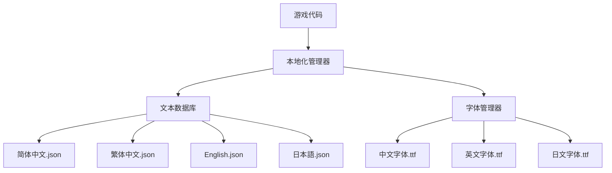

# 11-本地化与国际化方案

## 📋 文档概述

本文档描述了游戏的多语言支持方案，包括翻译系统架构、文本管理、文化适配和技术实现。确保游戏能够轻松适配全球不同地区的玩家。

**创建日期：** 2026-04-02  
**适用版本：** v1.0  
**支持语言：** 中文（简体）、中文（繁体）、English、日本語

---

## 一、多语言架构设计

### 1.1 翻译系统架构



### 1.2 支持的 locale 列表

| 语言 | Locale Code | 字体 | 文本方向 | 数字格式 |
|------|-------------|------|---------|---------|
| 简体中文 | zh_CN | 思源黑体 SC | LTR | 1,234.56 |
| 繁体中文 | zh_TW | 思源黑体 TC | LTR | 1,234.56 |
| English | en_US | Roboto | LTR | 1,234.56 |
| 日本語 | ja_JP | 源ノ角ゴシック | LTR | 1,234.56 |

---

## 二、文本管理系统

### 2.1 翻译键命名规范

```gdscript
# 命名格式：[模块].[子模块].[具体文本]
# 示例:

ui.main.start_game          # UI-主菜单 - 开始游戏
ui.main.settings            # UI-主菜单 - 设置
ui.main.quit                # UI-主菜单 - 退出

item.weapon.sword.name      # 物品 - 武器 - 剑 - 名称
item.weapon.sword.desc      # 物品 - 武器 - 剑 - 描述

quest.main.001.title        # 任务 - 主线 -001- 标题
quest.main.001.desc         # 任务 - 主线 -001- 描述

enemy.goblin.name           # 敌人 - 哥布林 - 名称
skill.warrior.bash.name     # 技能 - 战士 - 重击 - 名称

dialogue.npc.elder.001      # 对话-NPC-长老 -001 句
```

### 2.2 翻译文件格式

#### JSON 结构示例

```json
{
  "meta": {
    "language": "zh_CN",
    "language_name": "简体中文",
    "version": "1.0",
    "last_updated": "2026-04-02"
  },
  
  "translations": {
    "ui.main.start_game": "开始游戏",
    "ui.main.settings": "设置",
    "ui.main.quit": "退出游戏",
    
    "item.weapon.sword.001.name": "铁剑",
    "item.weapon.sword.001.desc": "一把普通的铁剑，适合新手使用。\\n攻击力：15-25\\n需要等级：10",
    
    "quest.main.001.title": "初出茅庐",
    "quest.main.001.objective": "击杀 10 只哥布林斥候",
    "quest.main.001.complete": "任务完成！获得经验 +500，金币 +100",
    
    "dialogue.npc.elder.greeting": "你好，年轻的冒险者。村庄外出现了哥布林...",
    "dialogue.npc.elder.farewell": "愿光明之神保佑你。"
  }
}
```

### 2.3 带参数的文本

```json
{
  "game.combat.damage": "造成 {amount} 点伤害",
  "game.combat.crit": "暴击！{amount} 点伤害",
  "game.level_up": "恭喜升级！当前等级：{level}",
  "game.gold_gained": "获得 {amount} 金币",
  "game.item.pickup": "获得 {item_name} ×{quantity}",
  
  "ui.inventory.slots": "背包：{current}/{max} 格",
  "ui.character.stats.hp": "生命值：{current}/{max}",
  "ui.character.stats.mp": "法力值：{current}/{max}"
}
```

**GDScript 使用示例：**

```gdscript
# LocalizationManager.gd
extends Node

var current_locale = "zh_CN"
var translations = {}

func _ready():
    load_translations(current_locale)

func load_translations(locale: String):
    var path = "res://resources/translations/%s.json" % locale
    var file = FileAccess.open(path, FileAccess.READ)
    var data = JSON.parse_string(file.get_as_text())
    translations = data.translations

func t(key: String, params: Dictionary = {}) -> String:
    if not translations.has(key):
        push_warning("Translation key not found: " + key)
        return "[MISSING: " + key + "]"
    
    var text = translations[key]
    
    # 替换参数
    for param_key in params:
        text = text.replace("{" + str(param_key) + "}", str(params[param_key]))
    
    return text

# 使用示例
func show_damage(damage: int):
    $DamageLabel.text = Localization.t("game.combat.damage", {"amount": damage})

func show_level_up(new_level: int):
    $MessageLabel.text = Localization.t("game.level_up", {"level": new_level})
```

---

## 三、字体管理

### 3.1 字体文件配置

| 语言 | 字体文件 | 大小 | 授权 |
|------|---------|------|------|
| 中文 | SourceHanSansSC-Regular.ttf | 4.5MB | SIL Open Font License |
| 英文 | Roboto-Regular.ttf | 157KB | Apache License 2.0 |
| 日文 | SourceHanSansJP-Regular.ttf | 4.8MB | SIL Open Font License |

### 3.2 动态字体加载

```gdscript
# FontManager.gd
extends Node

var font_cache: Dictionary = {}
var default_font_size = 16

const FONT_PATHS = {
    "zh_CN": "res://resources/fonts/NotoSansSC-Regular.ttf",
    "zh_TW": "res://resources/fonts/NotoSansTC-Regular.ttf",
    "en_US": "res://resources/fonts/Roboto-Regular.ttf",
    "ja_JP": "res://resources/fonts/NotoSansJP-Regular.ttf"
}

func get_font(locale: String, size: int = default_font_size) -> FontFile:
    var cache_key = "%s_%d" % [locale, size]
    
    if font_cache.has(cache_key):
        return font_cache[cache_key]
    
    var font_path = FONT_PATHS[locale]
    var font = FontFile.new()
    font.font_data = load(font_path).font_data
    font.size = size
    
    font_cache[cache_key] = font
    return font

func apply_font_to_control(control: Control, locale: String):
    var font = get_font(locale)
    
    # 递归应用到所有 Label 节点
    for child in control.get_children():
        if child is Label:
            child.add_theme_font_override("font", font)
        apply_font_to_control(child, locale)
```

### 3.3 文本自动换行

```gdscript
# 多语言文本自动适应
func setup_multilingual_label(label: Label, key: String, max_width: int):
    label.text = Localization.t(key)
    label.autowrap_mode = TextServer.AUTOWRAP_WORD_SMART
    label.size_flags_horizontal = Control.SIZE_SHRINK_BEGIN
    
    # 根据语言调整最大宽度
    match Localization.current_locale:
        "en_US":
            label.custom_minimum_size.x = max_width * 1.3  # 英文通常需要更多空间
        "ja_JP":
            label.custom_minimum_size.x = max_width * 1.1
        _:
            label.custom_minimum_size.x = max_width
```

---

## 四、文化适配

### 4.1 日期时间格式

```gdscript
# 日期格式化
func format_date(date: Dictionary) -> String:
    match current_locale:
        "zh_CN", "zh_TW":
            return "%d年%02d月%02d日" % [date.year, date.month, date.day]
        "en_US":
            return "%02d/%02d/%d" % [date.month, date.day, date.year]
        "ja_JP":
            return "%d年%02d月%02d日" % [date.year, date.month, date.day]
    return ""

# 时间格式化
func format_time(seconds: int) -> String:
    var mins = floor(seconds / 60)
    var secs = seconds % 60
    
    match current_locale:
        "zh_CN", "zh_TW":
            return "%d分%d秒" % [mins, secs]
        "en_US":
            return "%d:%02d" % [mins, secs]
        "ja_JP":
            return "%d分%d秒" % [mins, secs]
    return ""
```

### 4.2 数字格式化

```gdscript
# 大数字缩写
func format_large_number(number: int) -> String:
    if number >= 1000000:
        var millions = number / 1000000.0
        match current_locale:
            "zh_CN", "zh_TW":
                return "%.1f 百万" % millions
            "en_US":
                return "%.1fM" % millions
            "ja_JP":
                return "%.1f 百万" % millions
    elif number >= 1000:
        var thousands = number / 1000.0
        match current_locale:
            "zh_CN", "zh_TW":
                return "%.1f 千" % thousands
            "en_US":
                return "%.1fk" % thousands
            "ja_JP":
                return "%.1f 千" % thousands
    else:
        return str(number)
```

### 4.3 敏感内容处理

```gdscript
# 地区特定的内容过滤
var region_restrictions = {
    "CN": {
        "remove_blood": true,
        "remove_skulls": false,
        "modify_religious_symbols": true
    },
    "DE": {
        "remove_blood": true,
        "remove_nazi_symbols": true,  # 法律要求
        "age_rating_check": true
    },
    "JP": {
        "censor_revealing_clothing": false,
        "adjust_horror_elements": false
    }
}

func apply_region_restrictions(region: String):
    if region_restrictions.has(region):
        var rules = region_restrictions[region]
        if rules.remove_blood:
            disable_blood_effects()
        # ... 其他限制
```

---

## 五、UI 自适应布局

### 5.1 文本长度适配

```gdscript
# 动态按钮大小
func resize_button_to_text(button: Button, min_width: int = 150):
    var text_size = button.get_theme_font("font").get_string_size(
        button.text, HORIZONTAL_ALIGNMENT_LEFT, -1, button.font_size
    )
    
    var target_width = max(min_width, text_size.x + 40)  # 40px 边距
    button.custom_minimum_size.x = target_width
```

### 5.2 多语言 UI 预设

```gdscript
# 为不同语言保存不同的 UI 布局
var ui_presets = {
    "zh_CN": {
        "main_menu_button_width": 200,
        "inventory_slot_size": 50,
        "dialog_box_height": 150
    },
    "en_US": {
        "main_menu_button_width": 240,  # 英文文本更长
        "inventory_slot_size": 50,
        "dialog_box_height": 180
    },
    "ja_JP": {
        "main_menu_button_width": 220,
        "inventory_slot_size": 50,
        "dialog_box_height": 160
    }
}

func apply_ui_preset(locale: String):
    if ui_presets.has(locale):
        var preset = ui_presets[locale]
        # 应用预设值
        for control_name in preset:
            var control = get_node_or_null(control_name)
            if control:
                control.custom_minimum_size.x = preset[control_name]
```

---

## 六、翻译工作流程

### 6.1 提取待翻译文本

```python
# extract_texts.py - Python 脚本
import json
import re

def extract_translation_keys(source_code_dir):
    keys = set()
    
    # 扫描 GDScript 文件
    for root, dirs, files in os.walk(source_code_dir):
        for file in files:
            if file.endswith('.gd'):
                with open(os.path.join(root, file), 'r', encoding='utf-8') as f:
                    content = f.read()
                    # 查找 Localization.t("key") 调用
                    matches = re.findall(r'Localization\.t\(["\']([^"\']+)["\']', content)
                    keys.update(matches)
    
    return sorted(list(keys))

# 生成翻译模板
def generate_translation_template(keys):
    template = {
        "meta": {
            "language": "TEMPLATE",
            "version": "1.0"
        },
        "translations": {}
    }
    
    for key in keys:
        template["translations"][key] = "[待翻译]"
    
    return template
```

### 6.2 翻译进度追踪

```json
{
  "translation_status": {
    "zh_CN": {
      "total_keys": 500,
      "translated": 500,
      "reviewed": 480,
      "progress": 100
    },
    "en_US": {
      "total_keys": 500,
      "translated": 450,
      "reviewed": 400,
      "progress": 90
    },
    "ja_JP": {
      "total_keys": 500,
      "translated": 380,
      "reviewed": 300,
      "progress": 76
    }
  }
}
```

### 6.3 缺失翻译处理

```gdscript
# 优雅降级策略
func t_safe(key: String, params: Dictionary = {}) -> String:
    if not translations.has(key):
        # 回退到英文
        if fallback_translations.has(key):
            return fallback_translations[key]
        else:
            # 显示键名作为最后手段
            return "[MISSING:" + key + "]"
    
    return t(key, params)

# 运行时检测缺失
func check_missing_translations():
    var missing = []
    for key in required_keys:
        if not translations.has(key):
            missing.append(key)
    
    if missing.size() > 0:
        print("警告：缺少 %d 条翻译" % missing.size())
        print("缺失的键：" + str(missing))
```

---

## 七、技术实现

### 7.1 本地化管理器完整代码

```gdscript
# LocalizationManager.gd (完整实现)
extends Node

signal locale_changed(new_locale: String)

var current_locale = "zh_CN"
var translations = {}
var fallback_translations = {}
var supported_locales = ["zh_CN", "zh_TW", "en_US", "ja_JP"]

const FALLBACK_LOCALE = "zh_CN"

func _ready():
    _load_fallback_translations()
    set_locale(current_locale)

func _load_fallback_translations():
    var path = "res://resources/translations/%s.json" % FALLBACK_LOCALE
    if FileAccess.file_exists(path):
        var file = FileAccess.open(path, FileAccess.READ)
        var data = JSON.parse_string(file.get_as_text())
        fallback_translations = data.get("translations", {})

func set_locale(locale: String):
    if not locale in supported_locales:
        push_warning("Unsupported locale: " + locale)
        locale = FALLBACK_LOCALE
    
    current_locale = locale
    _load_translations(locale)
    locale_changed.emit(locale)
    
    # 更新所有 UI
    _update_all_ui_texts()

func _load_translations(locale: String):
    translations.clear()
    var path = "res://resources/translations/%s.json" % locale
    
    if FileAccess.file_exists(path):
        var file = FileAccess.open(path, FileAccess.READ)
        var data = JSON.parse_string(file.get_as_text())
        translations = data.get("translations", {})
    else:
        push_error("Translation file not found: " + path)

func t(key: String, params: Dictionary = {}) -> String:
    var text = translations.get(key, fallback_translations.get(key, "[MISSING:" + key + "]"))
    
    # 参数替换
    for param_key in params:
        var placeholder = "{" + str(param_key) + "}"
        text = text.replace(placeholder, str(params[param_key]))
    
    return text

func _update_all_ui_texts():
    # 遍历场景树，更新所有 LocalizableLabel
    for node in get_tree().get_nodes_in_group("localizable"):
        if node is Label and node.has_meta("translation_key"):
            var key = node.get_meta("translation_key")
            node.text = t(key)
```

### 7.2 可本地化 Label 组件

```gdscript
# LocalizableLabel.gd
@tool
class_name LocalizableLabel
extends Label

@export var translation_key: String:
    set(value):
        translation_key = value
        set_meta("translation_key", value)
        update_text()

func _ready():
    add_to_group("localizable")
    update_text()

func update_text():
    if translation_key != "" and has_node("/root/LocalizationManager"):
        text = Localization.t(translation_key)
```

---

## 八、测试清单

### 8.1 语言功能测试

- [ ] 所有文本正确显示
- [ ] 参数替换正常工作
- [ ] 特殊字符正确渲染
- [ ] 字体加载无错误
- [ ] 文本溢出处理正确

### 8.2 UI 适配测试

- [ ] 按钮大小适应所有语言
- [ ] 文本框自动换行正常
- [ ] 窗口大小合适
- [ ] 图标和文本对齐

### 8.3 文化适配测试

- [ ] 日期格式正确
- [ ] 数字格式正确
- [ ] 货币符号正确
- [ ] 无文化敏感内容

---

*文档版本：v1.0*  
*创建日期：2026-04-02*  
*适用引擎：Godot 4.x*  
*支持语言：4 种*
