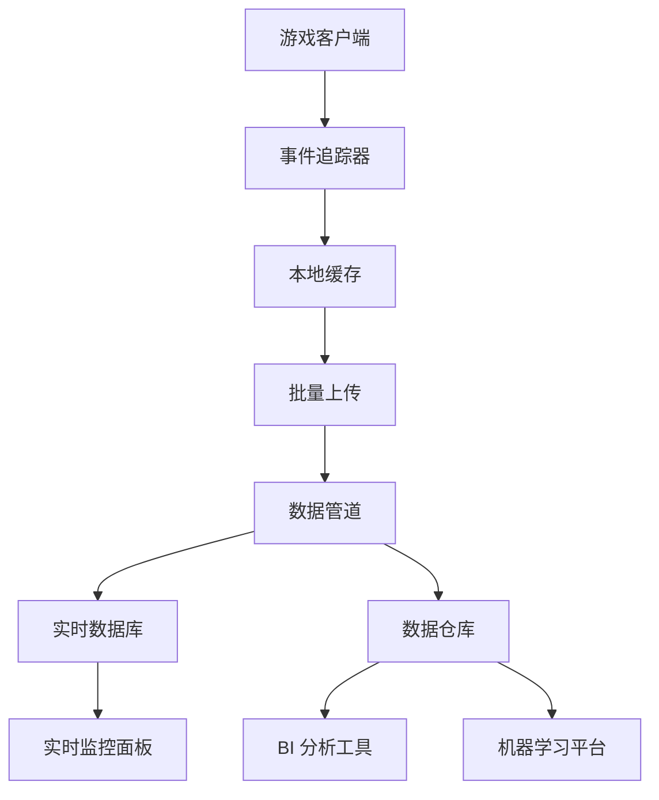

# 13-数据分析与运营工具设计

## 📋 文档概述

本文档描述了游戏的数据采集、分析系统和运营工具设计，包括用户行为埋点、数据统计、实时监控和后台管理功能。帮助开发团队了解玩家行为，优化游戏体验。

**创建日期：** 2026-04-02  
**适用版本：** v1.0  
**数据平台：** 自建/第三方（如 Unity Analytics）

---

## 一、数据采集架构

### 1.1 整体架构



### 1.2 数据上传策略

```gdscript
# 批量上传配置
var upload_config = {
    "batch_size": 50,           # 每批最多 50 条
    "batch_interval": 30.0,     # 30 秒上传一次
    "max_retries": 3,           # 最大重试次数
    "retry_delay": 5.0,         # 重试间隔 5 秒
    "compress_data": true,      # 压缩数据
    "encrypt_data": true        # 加密传输
}

# 本地缓存
var event_cache: Array[Dictionary] = []
var cache_dirty = false

func track_event(event_name: String, properties: Dictionary):
    var event_data = {
        "event_id": generate_uuid(),
        "event_name": event_name,
        "timestamp": Time.get_unix_time_from_system(),
        "player_id": PlayerManager.player_id,
        "session_id": GameManager.session_id,
        "properties": properties,
        "device_info": get_device_info(),
        "game_version": ProjectSettings.get_setting("application/config/version")
    }
    
    event_cache.append(event_data)
    cache_dirty = true
    
    # 检查是否需要上传
    if event_cache.size() >= upload_config.batch_size:
        upload_events()
    elif not upload_timer.is_connected("timeout", upload_events):
        upload_timer.start(upload_config.batch_interval)

func upload_events():
    if event_cache.is_empty():
        return
    
    # 压缩并加密
    var data = JSON.stringify(event_cache)
    var compressed = compress_data(data)
    var encrypted = encrypt_data(compressed)
    
    # 异步上传
    var http = HTTPRequest.new()
    add_child(http)
    var headers = ["Content-Type: application/json"]
    http.request_completed.connect(_on_upload_completed.bind(http))
    http.request("https://api.yourgame.com/events", headers, HTTPClient.METHOD_POST, encrypted)
```

---

## 二、核心事件定义

### 2.1 用户生命周期事件

| 事件名 | 触发时机 | 关键属性 |
|--------|---------|---------|
| user_created | 创建角色 | 职业、性别、外观 |
| tutorial_start | 开始新手引导 | 引导版本 |
| tutorial_complete | 完成新手引导 | 耗时、评分 |
| level_up | 角色升级 | 新等级、耗时 |
| first_purchase | 首次购买 | 物品 ID、价格 |
| user_return | 回归游戏 | 离线时长 |

### 2.2 战斗相关事件

```gdscript
# 战斗事件详细属性
var combat_events = {
    "combat_started": {
        "enemy_id": "enemy_001",
        "enemy_level": 10,
        "zone_id": "zone_forest",
        "is_elite": false,
        "party_size": 1
    },
    
    "damage_dealt": {
        "skill_id": "skill_001",
        "damage_amount": 150,
        "is_critical": true,
        "target_id": "enemy_001"
    },
    
    "damage_taken": {
        "source_id": "enemy_001",
        "damage_amount": 50,
        "damage_type": "physical",
        "current_hp_percent": 0.75
    },
    
    "combat_victory": {
        "duration_seconds": 30.5,
        "dps": 492,
        "damage_taken_total": 150,
        "potions_used": 1
    },
    
    "combat_defeat": {
        "survival_time": 15.2,
        "enemy_hp_percent": 0.60,
        "death_reason": "overwhelmed"
    }
}
```

### 2.3 经济系统事件

| 事件名 | 属性示例 | 分析目的 |
|--------|---------|---------|
| gold_earned | 来源、数量、加成 | 金币产出监控 |
| gold_spent | 用途、数量、物品 | 金币消耗分析 |
| item_acquired | 物品 ID、品质、来源 | 物品获取途径 |
| item_consumed | 物品 ID、数量、效果 | 消耗品使用率 |
| item_sold | 物品 ID、价格、数量 | 商店经济平衡 |

### 2.4 挂机系统事件

```gdscript
var hangup_events = {
    "hangup_started": {
        "config": {
            "skill_priority": ["skill_001", "skill_002"],
            "hp_threshold": 0.6,
            "mp_threshold": 0.8,
            "loot_filter": ["rare", "legendary"]
        },
        "location": "dungeon_02"
    },
    
    "hangup_stopped": {
        "reason": "bag_full",  # manual/bag_full/death/low_hp
        "duration_seconds": 1800,
        "kills": 45,
        "exp_gained": 5000,
        "gold_gained": 800,
        "items_gained": 12
    },
    
    "hangup_efficiency": {
        "dps": 485,
        "kill_rate": 0.025,  # kills per second
        "death_count": 0,
        "efficiency_score": 0.92  # 92% efficiency
    }
}
```

---

## 三、数据统计指标

### 3.1 基础指标（KPI）

| 指标 | 公式 | 日标值 | 用途 |
|------|------|--------|------|
| DAU | 当日活跃用户数 | 1000+ | 规模监控 |
| WAU | 当周活跃用户数 | 5000+ | 周活跃度 |
| MAU | 当月活跃用户数 | 15000+ | 月活跃度 |
| PCU | 同时在线峰值 | 500+ | 服务器压力 |
| ACU | 平均在线人数 | 200+ | 平均负载 |

### 3.2 留存率指标

```gdscript
# 留存率计算
func calculate_retention(day: int) -> float:
    var new_users_today = get_new_users_by_date(today)
    var new_users_past = get_new_users_by_date(today - day)
    var active_from_past = get_active_users_by_signup_date(today - day)
    
    if new_users_past == 0:
        return 0.0
    
    return (active_from_past / new_users_today) * 100.0

# 目标留存率
var retention_targets = {
    "day_1": 0.40,   # 次日留存 40%
    "day_3": 0.25,   # 3 日留存 25%
    "day_7": 0.15,   # 7 日留存 15%
    "day_30": 0.05   # 30 日留存 5%
}
```

### 3.3 付费指标

| 指标 | 公式 | 健康值 | 说明 |
|------|------|--------|------|
| 付费率 | 付费用户/活跃用户 | 3-5% | 付费渗透 |
| ARPU | 总收入/活跃用户 | $2-5 | 单用户收入 |
| ARPPU | 总收入/付费用户 | $50-100 | 付费用户价值 |
| LTV | 用户生命周期价值 | >$20 | 长期价值 |

### 3.4 游戏平衡指标

```gdscript
var balance_metrics = {
    "avg_level_time": {
        "target": 120,  # 平均每级 2 分钟
        "warning_min": 60,
        "warning_max": 300
    },
    
    "death_rate": {
        "target": 0.05,  # 5% 死亡率
        "warning_threshold": 0.15
    },
    
    "gold_income_per_hour": {
        "target": 1000,  # 每小时 1000 金币
        "inflation_warning": 1500
    },
    
    "gear_progression": {
        "white_at_level_10": 0.80,  # 80% 白色装备
        "magic_at_level_20": 0.60,
        "rare_at_level_40": 0.40,
        "legendary_at_level_80": 0.10
    }
}
```

---

## 四、实时监控面板

### 4.1 服务器状态监控

```gdscript
# 服务器健康度仪表板
var server_dashboard = {
    "server_status": {
        "online": true,
        "uptime": "15d 7h 23m",
        "cpu_usage": 45.2,  # %
        "memory_usage": 62.8,  # %
        "disk_usage": 38.5,  # %
        "network_in": 125.5,  # KB/s
        "network_out": 340.2  # KB/s
    },
    
    "player_stats": {
        "online_now": 234,
        "peak_today": 456,
        "login_rate": 12.5,  # logins per minute
        "logout_rate": 10.2
    },
    
    "error_tracking": {
        "errors_last_hour": 3,
        "crashes_last_hour": 0,
        "top_error": "connection_timeout"
    }
}
```

### 4.2 异常告警规则

```gdscript
var alert_rules = [
    {
        "name": "服务器宕机",
        "condition": "server_online == false",
        "severity": "critical",
        "notify": ["sms", "email", "slack"],
        "action": "auto_restart"
    },
    {
        "name": "高错误率",
        "condition": "error_rate > 0.05",  # 5% 错误率
        "severity": "warning",
        "notify": ["slack"],
        "action": "investigate"
    },
    {
        "name": "支付失败激增",
        "condition": "payment_failure_rate > 0.10",
        "severity": "critical",
        "notify": ["sms", "email"],
        "action": "check_payment_gateway"
    },
    {
        "name": "刷金币检测",
        "condition": "gold_per_hour > 5000",
        "severity": "warning",
        "notify": ["email"],
        "action": "flag_for_review"
    }
]
```

---

## 五、运营后台工具

### 5.1 用户管理

```gdscript
# GM 命令后台
var gm_tools = {
    "user_management": {
        "search_user": func(player_id): return user_profile,
        "ban_user": func(player_id, reason, duration): ban_player,
        "unban_user": func(player_id): unban_player,
        "reset_character": func(player_id): reset_progress,
        "compensate_item": func(player_id, item_id, quantity): send_mail
    },
    
    "game_control": {
        "announce": func(message): broadcast_message,
        "schedule_event": func(event_type, start_time, end_time): create_event,
        "adjust_drop_rate": func(item_id, multiplier): update_drop_table,
        "maintenance_mode": func(enabled): toggle_maintenance
    },
    
    "data_query": {
        "user_stats": func(player_id): get_statistics,
        "item_distribution": func(item_id): get_ownership,
        "leaderboard": func(metric, limit): get_rankings,
        "replay_session": func(session_id): replay_gameplay
    }
}
```

### 5.2 活动配置系统

```gdscript
# 运营活动配置
var activity_config = {
    "activity_id": "double_exp_weekend",
    "activity_name": "双倍经验周末",
    "start_time": "2026-04-10 00:00:00",
    "end_time": "2026-04-12 23:59:59",
    "type": "global_buff",
    "parameters": {
        "exp_multiplier": 2.0,
        "applicable_zones": ["all"],
        "exclude_party_bonus": false
    },
    "notification": {
        "pre_announce": true,
        "announce_days_before": 3,
        "in_game_popup": true,
        "mail_notification": true
    },
    "budget": {
        "additional_exp_cost": 500000,  # 预计额外经验产出
        "impact_analysis": "low_risk"
    }
}

# 动态调整
func activate_activity(activity_id: String):
    var config = load_activity_config(activity_id)
    apply_activity_effects(config)
    notify_players(config.notification)
    log_activity_start(activity_id)
```

### 5.3 A/B 测试框架

```gdscript
# A/B 测试配置
var ab_test_config = {
    "test_id": "pricing_test_001",
    "test_name": "商店价格测试",
    "start_date": "2026-04-01",
    "end_date": "2026-04-30",
    
    "variants": {
        "A": {
            "name": "对照组",
            "users_percentage": 50,
            "changes": {}  # 无变化
        },
        "B": {
            "name": "实验组",
            "users_percentage": 50,
            "changes": {
                "shop_prices_multiplier": 0.8  # 8 折
            }
        }
    },
    
    "metrics_to_track": [
        "purchase_rate",
        "average_order_value",
        "total_revenue",
        "user_satisfaction"
    ],
    
    "success_criteria": {
        "min_sample_size": 1000,
        "confidence_level": 0.95,
        "min_lift": 0.10  # 至少 10% 提升
    }
}
```

---

## 六、数据安全与隐私

### 6.1 数据脱敏

```gdscript
# 敏感信息处理
func sanitize_player_data(data: Dictionary) -> Dictionary:
    var sanitized = data.duplicate()
    
    # 移除个人身份信息
    sanitized.erase("email")
    sanitized.erase("phone_number")
    
    # 哈希处理用户 ID
    sanitized["player_id_hash"] = hash(sanitized["player_id"])
    sanitized.erase("player_id")
    
    # 模糊化位置信息
    if sanitized.has("location"):
        sanitized["location_region"] = get_region_from_location(sanitized["location"])
        sanitized.erase("location")
    
    return sanitized
```

### 6.2 权限控制

```gdscript
# 角色权限定义
var role_permissions = {
    "admin": {
        "can_ban_users": true,
        "can_modify_game_data": true,
        "can_access_financial_data": true,
        "can_run_ab_tests": true
    },
    "moderator": {
        "can_ban_users": true,
        "can_modify_game_data": false,
        "can_access_financial_data": false,
        "can_run_ab_tests": false
    },
    "analyst": {
        "can_view_analytics": true,
        "can_export_data": true,
        "can_modify_data": false
    },
    "developer": {
        "can_view_logs": true,
        "can_deploy_configs": true,
        "can_access_production_db": false
    }
}
```

---

## 七、报表系统

### 7.1 日报模板

```markdown
# 游戏运营日报
日期：2026-04-02

## 核心数据
- DAU: 1,234 (环比 +5.2%)
- 新增用户：156
- 付费率：3.8%
- 收入：¥12,450

## 异常指标
- 无

## TOP 问题
1. 部分玩家反映挂机效率低
2. 3 号 BOSS 难度过高

## 今日活动
- 双倍经验周末活动进行中

## 待办事项
- 调整 3 号 BOSS 数值
- 优化挂机 AI
```

### 7.2 自动化报表

```gdscript
# 定时生成报表
var report_schedule = {
    "daily_report": {
        "time": "09:00",
        "recipients": ["team@company.com"],
        "format": "email",
        "metrics": ["dau", "revenue", "retention"]
    },
    
    "weekly_report": {
        "day": "monday",
        "time": "10:00",
        "recipients": ["management@company.com"],
        "format": "pdf",
        "include_charts": true
    },
    
    "monthly_report": {
        "day": 1,
        "time": "14:00",
        "recipients": ["stakeholders@company.com"],
        "format": "presentation",
        "deep_analysis": true
    }
}
```

---

*文档版本：v1.0*  
*创建日期：2026-04-02*  
*适用平台：**全平台*  
*合规要求：GDPR/COPPA*
